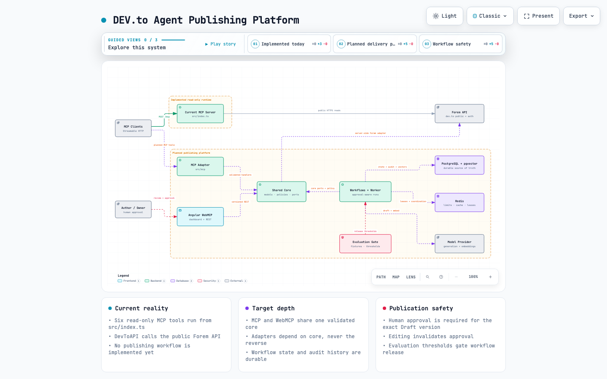

# DEV.to MCP Server

A read-only remote [Model Context Protocol](https://modelcontextprotocol.io/) server for discovering public DEV.to content through the Forem API. It exposes six tools over Streamable HTTP and does not require a DEV.to API key.

## Contents

- [Project overview](#project-overview)
- [Capabilities](#capabilities)
- [Quick start](#quick-start)
- [Connect an MCP client](#connect-an-mcp-client)
- [Configuration](#configuration)
- [Development](#development)
- [Docker](#docker)
- [Documentation](#documentation)
- [Release status](#release-status)

## Project overview

The current runtime accepts MCP requests, routes each tool call to a small DEV.to API client, and returns the public response in an MCP text-content envelope. The repository also documents a planned approval-aware publishing platform; planned components are clearly separated from implemented behavior.

[](docs/architecture/project-architecture.html)

Open the [interactive architecture viewer](docs/architecture/project-architecture.html) or browse the complete [architecture artifact catalog](docs/architecture/README.md).

## Capabilities

All tools are marked read-only and open-world.

| Tool | Purpose | Main inputs |
| --- | --- | --- |
| `get_articles` | List public articles | `username`, `tag`, `top`, `page`, `per_page`, `state` |
| `get_article` | Retrieve one article | `id` or `path` |
| `get_user` | Retrieve one public user | `id` or `username` |
| `get_tags` | List popular tags | `page`, `per_page` |
| `get_comments` | List comments for an article | `article_id` |
| `search_articles` | Search DEV.to feed content | `q`, `page`, `per_page`, `search_fields` |

## Quick start

Requirements:

- Node.js 22 or newer
- npm

```bash
npm ci
npm run build
npm start
```

The MCP endpoint is available at `http://127.0.0.1:3000/mcp`. Confirm the server is running:

```bash
curl http://127.0.0.1:3000/mcp
```

For a guided setup, follow the [getting-started tutorial](docs/tutorials/getting-started.md).

## Connect an MCP client

Configure an MCP client that supports Streamable HTTP with this server URL:

```text
http://127.0.0.1:3000/mcp
```

See [Connect an MCP client](docs/how-to/connect-an-mcp-client.md) for the generic configuration shape, session behavior, and troubleshooting steps.

## Configuration

| Variable | Default | Accepted values or purpose |
| --- | --- | --- |
| `PORT` | `3000` | HTTP listening port |
| `NODE_ENV` | `development` | `development`, `production`, or `test` |
| `SERVER_NAME` | `dev-to-mcp` | Server name used by runtime configuration |
| `SERVER_VERSION` | `1.0.0` | Server version used by runtime configuration |
| `LOG_LEVEL` | `info` | `error`, `warn`, `info`, or `debug` |

## Development

```bash
npm run dev
npm run typecheck
npm run lint
npm run format:check
npm run test:ci
npm run build
```

Contributor setup, repository boundaries, and the pull-request checklist are documented in [Contributing](docs/CONTRIBUTING.md).

## Docker

Build and run the MCP server from source:

```bash
docker build -t dev-to-mcp .
docker run --rm -p 3000:3000 dev-to-mcp
```

The checked-in Compose file starts loopback-bound PostgreSQL/pgvector and Redis services reserved for future adapters. The current MCP server does not use them and still runs separately.

```bash
docker compose up -d
docker compose ps
npm run dev
```

## Documentation

Start at the [documentation index](docs/README.md):

- [Getting started](docs/tutorials/getting-started.md)
- [Connect an MCP client](docs/how-to/connect-an-mcp-client.md)
- [Architecture baseline](docs/reference/architecture-baseline.md)
- [Domain language](docs/explanation/domain-language.md)
- [Implementation plan](docs/explanation/implementation-plan.md)
- [Software requirements](docs/requirements/DEVto_Agent_Publishing_Platform_SRS.docx)

## Release status

The production dependency audit passes against the checked-in lockfile. A pre-built image is not published. No repository-level license grant has been verified for the upstream source. Although package metadata labels the project MIT, do not redistribute source or images until provenance and licensing are confirmed.
